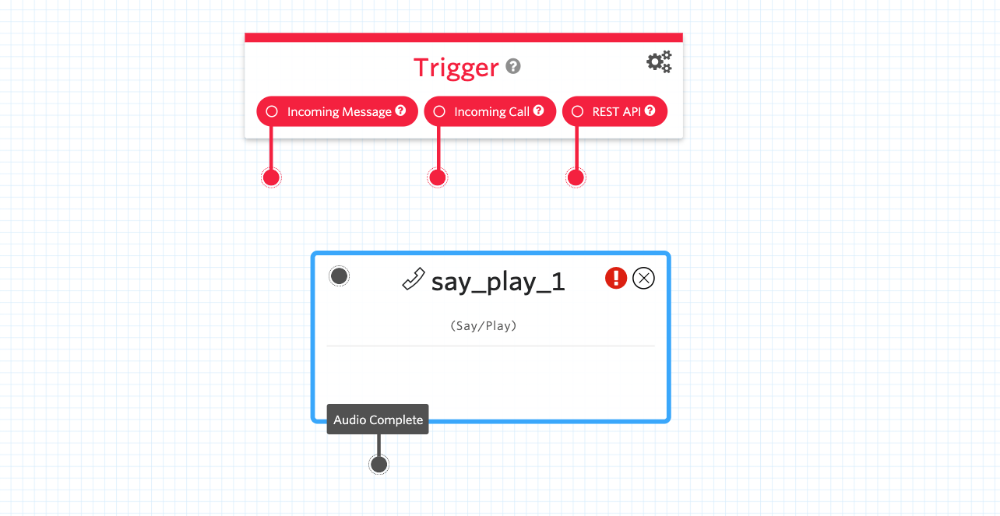
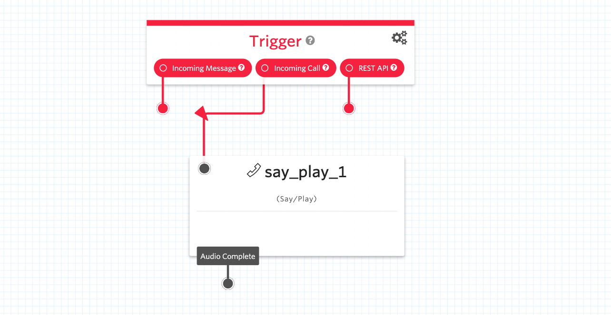
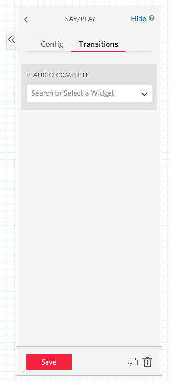
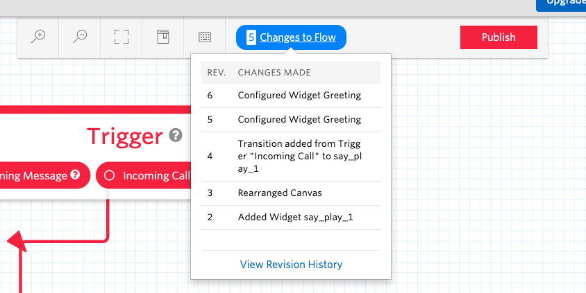
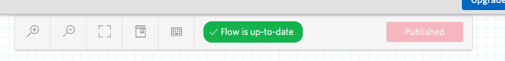

#  手順2: Say/Play ウィジェットの利用

この手順では、指定したテキストまたは音声ファイルを再生できる`Say/Play`ウィジェットをフローに追加し、設定を変更する方法を学習します。

## 2-1. Say/Play ウィジェットを追加し、Triggerと接続

右側のウィジェットライブラリから`Say/Play`ウィジェットをデザインキャンバスにドラッグドロップします。

次にフローの出発点である`Trigger`ウィジェットの`Incoming Call`とSay/Playウィジェットを接続します。

## 2-2. Say/Playウィジェットの設定

ウィジェットをクリックするとウィジェットが選択状態となり、ウィジェットライブラリが表示されていた領域に設定項目が表示されます。

`Config`タブではウィジェットの設定を行えます。それぞれ下記のように変更します。

|設定項目|値|
|:----|:----|
|WIDGET NAME| Greeting |
|TEXT TO SAY| お電話ありがとうございます。今日はスタジオハンズオンの開催日です。|
|LANGUAGE|Japanese|
|MESSAGE VOICE| Alice、\[Polly\] Mizuki、\[Polly\] Takumiのいずれか|

`Transitions`タブではフローの接続先を設定・変更できます。今回、特に作業項目はありません。

忘れずに`Save`ボタンをクリックし内容を保存しましょう。

## 2-3. 変更履歴とフローの公開

デザイン画面で変更した内容はそのつど保存されています。画面上部の変更履歴ボタンをクリックし確認できます。

設定をすべて完了した時点で`Publish`ボタンをクリックしフローを公開します。確認ダイアログが表示されますが、続けて`Publish`ボタンをクリックします。下記のように`Flow is up-to-date`となっていることを確認します。

さて、これでフローが完成しました。次の手順でこのフローを電話番号に接続します。

## 関連リソース

- [Twilio CLI Quickstart](https://www.twilio.com/docs/twilio-cli/quickstart)

## 次の手順
[手順3: 電話番号に接続](03-Connect-Flow-To-Phone-Number.md)
