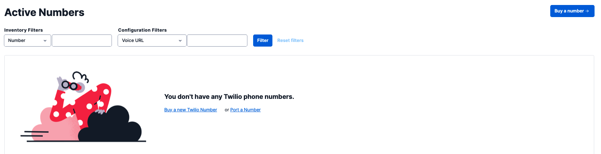
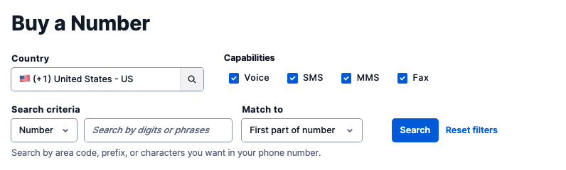
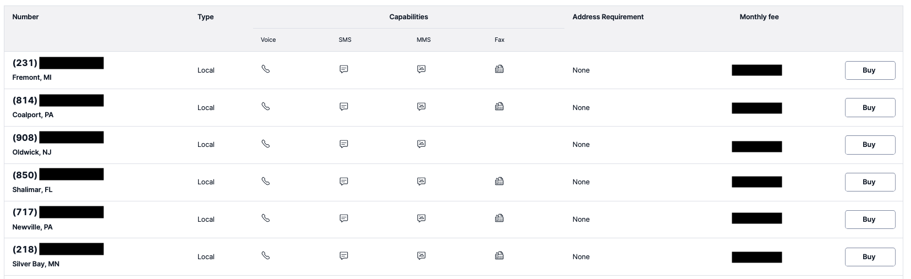
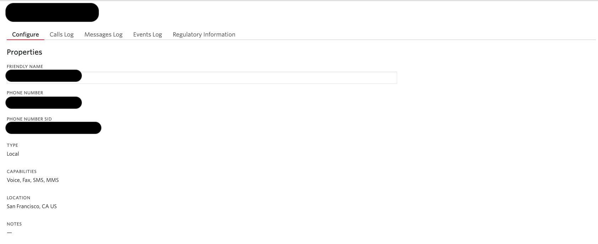
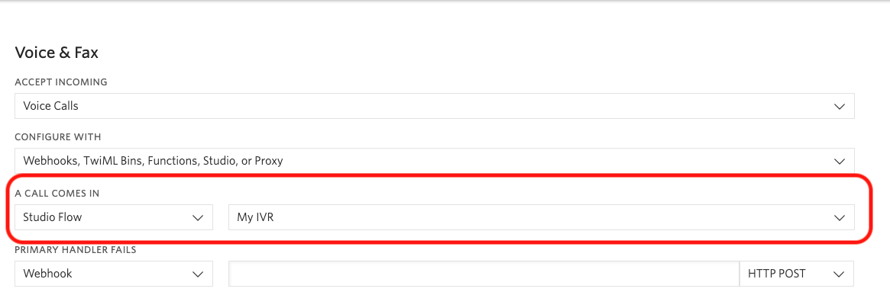

#  手順3: 電話番号に接続

この手順では、Studioで作成したフローを電話番号に接続する方法を学習します。

## 3-1. 電話番号を取得

まず、フローを接続するTwilioが提供する電話番号を取得します。Twilio番号をすでに持っている場合はこの項目をスキップしてください。

[Twilioコンソール](https://www.twilio.com/console/phone-numbers/incoming)を開き`Buy a new Twilio Number`リンクをクリックします。

次の画面で購入可能な電話番号を検索できます。日本の番号を取得する場合、本人確認作業が発生します。そのため即時に購入ができないので今回は米国番号を取得します。

また、電話番号を購入する場合、回線維持料金が必要になります。国、電話番号の種類よって料金が変わります。ただしトライアルアカウントの場合、無料クレジットが使用されるため心配はありません。

`COUNTRY`をUnited Stats、`CAPABILITIES`の`SMS`にチェックを入れ、`検索`ボタンをクリックします。

購入可能な番号一覧が表示されます。好きな番号を選び、`購入`ボタンで購入してください。

## 3-2. 電話にフローを接続

電話番号の購入後にその番号の設定画面が表示されます。すでに番号を持っている場合は、[アクティブな電話番号](https://www.twilio.com/console/phone-numbers/incoming)から番号をクリックします。

`Voice & Fax`セクションの`A CALL COMES IN`項目を設定します。
最初のドロップダウンで`Studio Flow`を選択し、次のドロップダウンで先ほど作成したフローを選択します。

忘れずに`Save`ボタンをクリックしましょう。よく忘れがちな手順です。

## 3-3. Let's Test

それではこの番号に電話をかけてみましょう。トライアルアカウントを利用している場合は、最初に英語でトライアルアカウントである旨のメッセージが流れます。このメッセージはスキップできないので最後まで聴いてください。

その後任意の電話番号キーを押すとフローが開始されます。設定通りに音声が再生されたでしょうか。

次のハンズオンではこのフローをさらにカスタマイズします。

## 関連リソース

- [Twilio CLI Quickstart](https://www.twilio.com/docs/twilio-cli/quickstart)

## 次のハンズオン

[ハンズオン: 発信者の入力に合わせたフローの分岐](/docs/02-Split-Flow/00-Overview.md)