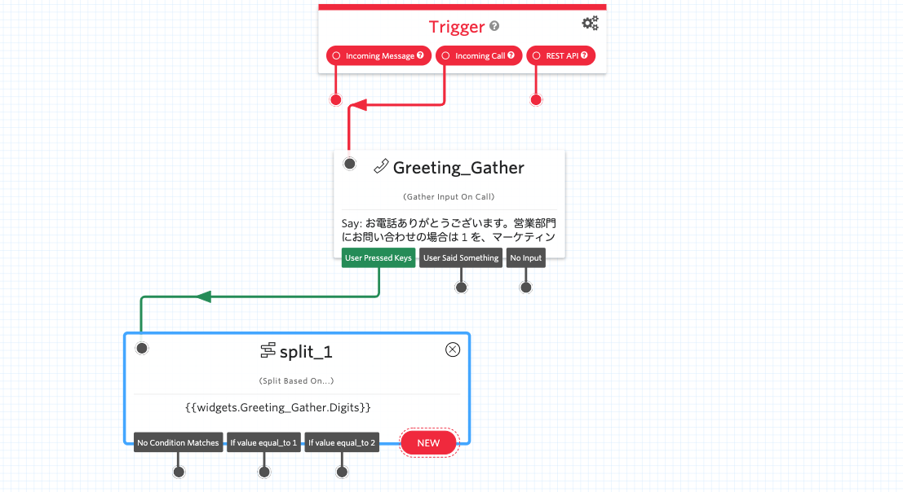

#  手順1: 発信者入力を取得し、フローを分岐させる

この手順では、発信者の入力を取得しその内容をもとにフローを分岐させます。

## 1-1. Gather Input on Call ウィジェットを追加する

まず、既存のウィジェットを削除するため、先のハンズオンで設定した`Say/Play`ウィジェットを選択し右上の`x`マークをクリックします。

続けて`Gather Input on Call`ウィジェットを追加し、`Trigger`ウィジェットの`Incoming Call`と接続します。

このウィジェットの`Congfig`設定を次のように設定します。

|設定項目|値|
|:----|:----|
|WIDGET NAME| Greeting_Gather |
|TEXT TO SAY| お電話ありがとうございます。営業部門にお問い合わせの場合は 1 を、マーケティング部門にお問い合わせの場合は2を押してください。当社のテーマソングをお聴きになる場合は何かおはなしください。|
|LANGUAGE|Japanese|
|MESSAGE VOICE| Alice、\[Polly\] Mizuki、\[Polly\] Takumiのいずれか|
|SPEECH RECOGNITION LANGUAGE|Japanese (Japan)|
  

## 1-2. Splitウィジェットの追加

`Split`ウィジェットを1つ追加し、`Greeting_Gather`ウィジェットの`User Pressed Keys`と接続します。

`split_1`ウィジェットの`Config`設定を次のように変更します。

|設定項目|値|
|:----|:----|
|VARIABLE TO TEST| widgets.Greeting_Gather.Digits |

続けて`split_1`ウィジェットの`Transitions`設定を開き、`NEW Condition`の`+`ボタンで分岐を2つ作成します。それぞれ、条件を`Equal To` - `1`、`Equal To` - `2`と設定します。下記のスクリーンショットを参考にしてください。

ここまでのステップでデザインキャンバスは下記のようになっています。

次の手順では分岐後のアクションを追加します。

## 関連リソース

- [Twilio CLI Quickstart](https://www.twilio.com/docs/twilio-cli/quickstart)

## 次の手順
[手順2: 分岐したフローをそれぞれ設定する](02-Setting-Wdigets.md)
