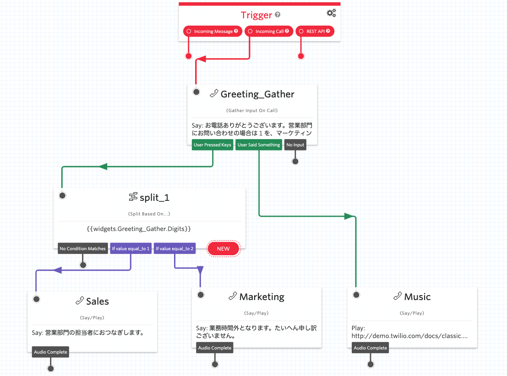

#  手順2: 分岐したフローをそれぞれ設定する

この手順では、分岐後のフローをそれぞれ設定します。

## 2-1. 各ウィジェットを追加する

`Say/Play`ウィジェットを3つ新たに追加し、それぞれ次のように設定します。

### Say/Playウィジェット その1

|設定項目|値|
|:----|:----|
|WIDGET NAME| Sales |
|TEXT TO SAY| 営業部門の担当者におつなぎします。|
|LANGUAGE|Japanese|
|MESSAGE VOICE| Alice、\[Polly\] Mizuki、\[Polly\] Takumiのいずれか|

`split_1`ウィジェットの`If value equal_to 1`と接続。

### Say/Playウィジェット その2

|設定項目|値|
|:----|:----|
|WIDGET NAME| Marketing |
|TEXT TO SAY| 業務時間外となります。たいへん申し訳ございません。|
|LANGUAGE|Japanese|
|MESSAGE VOICE| Alice、\[Polly\] Mizuki、\[Polly\] Takumiのいずれか|

`split_1`ウィジェットの`If value equal_to 2`と接続。

### Say/Playウィジェット その3

|設定項目|値|
|:----|:----|
|WIDGET NAME| Music |
|SAY OR PLAY MESSAGE OR DIGITS|Play a Message|
|URL OF AUDIO FILE|http://demo.twilio.com/docs/classic.mp3|

`Greeting_Gather`ウィジェットの`User Said Something`と接続。

ここまでのステップでデザインキャンバスは下記のようになっています。

フローをパブリッシュします。Twilio番号に電話をかけ、それぞれのオプションを確認しましょう。

## 関連リソース

- [Twilio CLI Quickstart](https://www.twilio.com/docs/twilio-cli/quickstart)

## 次のハンズオン
[ハンズオン: 高度な機能の活用](../03-Studio-Advanced-Features/00-Overview.md)