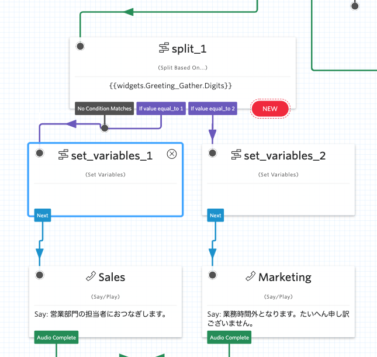

#  手順1: 変数を追加する

この手順では、フロー実行時に特定の値を設定する方法を学習します。

## 1-1. Set Variablesウィジェットを追加

`Set Variables`ウィジェットを2つ追加し、それぞれの条件分岐と`Sales`、`Marketing`を接続します。下記のスクリーンショットを参考にしてください。

追加したウィジェットの`Config`画面の設定をそれぞれ行います。

### set_variables_1ウィジェット

|設定項目|値|
|:----|:----|
|Key| channel|
|Value|営業部|

### set_variables_2ウィジェット

|設定項目|値|
|:----|:----|
|Key| channel|
|Value|マーケティング部|

以上で入力に応じて変数に値が設定されます。次の手順ではこれらの値を用いてSMSを送信します。

## 関連リソース

- [Twilio CLI Quickstart](https://www.twilio.com/docs/twilio-cli/quickstart)

## 次の手順
[手順2: SMSをテンプレートを使って送信する](02-Use-SMS-Template.md)
