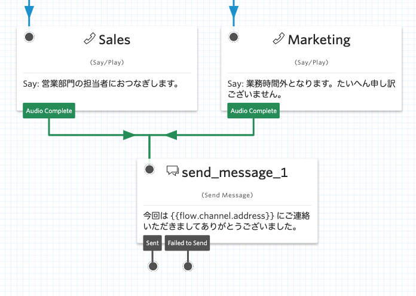

#  手順2: SMSをテンプレートを使って送信する

この手順では、SMSの送信する並びにフロー実行時のデータを利用する方法を学習します。

## 2-1. Send Messageウィジェットを追加

`Send Message`ウィジェットを追加し、`Sales`、`Marketing`それぞれの`Audio Complete`と接続します。下記のスクリーンショットを参考にしてください。

追加したウィジェットの`Config`画面の設定を下記のように行います。

|設定項目|値|
|:----|:----|
|MESSAGE BODY| 今回は当社の{{flow.variables.channel}}にご連絡いただきましてありがとうございました。|

ここで利用されている記法は[Liquit Template Language](https://jp.twilio.com/docs/studio/user-guide/liquid-template-language)と呼ばれており、実行時に動的な値を設定できます。

ここまで設定を終えた段階でTwilio番号に電話をかけ、営業部門、マーケティング部門へのフローを実行しましょう。SMSが最後に送られてくれば成功です。ただし、トライアルアカウントの場合は検証済み番号（自分自身の番号）にSMSを送信できません。動作を確認する場合は自分の携帯からかけてみてください。

--------------------------------

## （注）国際SMSの受信と返信について

今回のように米国番号からSMSを日本の番号に送信する場合、メッセージが国際SMSとして取り扱われます。ご自身の利用キャリアや契約番号のフィルタリング設定によっては受信ができません。またこれらのSMSへの返信は有料となる場合が多いため、あらかじめご自身が利用されているキャリアのプランをご確認ください。

日本国内向けに到達率を高めたい場合、高品質SMSサービスを利用できます。詳細については[営業部までお問い合わせ](https://jp.twilio.com/japan/help/sales)ください。

--------------------------------

これでハンズオンの基本コースは完了です。時間があれば追加で[手順3: （オプション）外部のサービスと連携する](./03-Use-Http-Request.md)に挑戦してください。

そのほかにもいろいろなシナリオで利用できるため、ぜひこちらの[チュートリアル（英語）](https://jp.twilio.com/docs/studio/tutorials)に挑戦してみましょう。

## 関連リソース

- [Twilio CLI Quickstart](https://www.twilio.com/docs/twilio-cli/quickstart)
