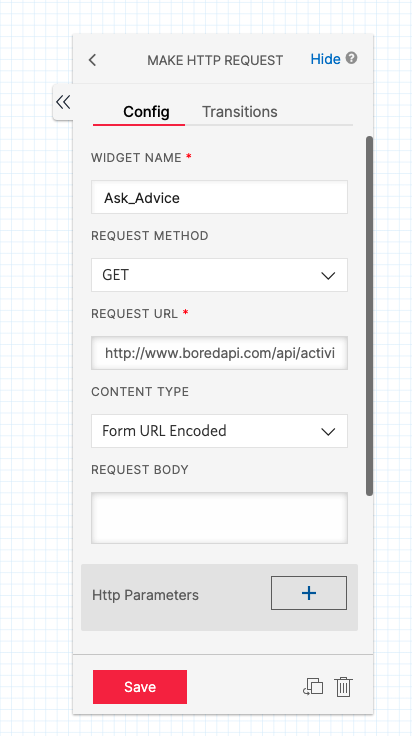

#  手順3: （オプション）外部のサービスと連携する

この手順では、フローから外部のサービスを呼び出して利用する方法を学習します。

## 3-1. Say/Playメッセージを変更する

`Marketing Say/Play`ウィジェットのメッセージを次のように変更すします。

|設定項目|値|
|:----|:----|
|TEXT TO SAY| 業務時間外となります。たいへん申し訳ございません。お詫びに本日のアドバイスを再生します。|

## 3-2. 外部にリクエストを発信する

`Make HTTP Request`ウィジェットを追加し、`Marketing Say/Play`ウィジェットの`Audio Complete`と接続します。

今回は[アドバイスを英語で送ってくれるAPI](https://www.boredapi.com/api/activity/)と接続します。それぞれ下記の値を設定してください。

|設定項目|値|
|:----|:----|
|WIDGET NAME| Ask_Advice|
|REQUEST METHOD| GET|
|REQUEST URL|https://www.boredapi.com/api/activity/|

スクリーンショットも参考にしてください。

## 3-3. 取得した値をもとにSMSを送信する

`Say/Play` ウィジェットをさらに追加し、`http_1`の`Success`に接続します。

下記のように外部から返された値を使ってメッセージを再生しましょう。

|設定項目|値|
|:----|:----|
|WIDGET NAME| Say_Advice|
|TEXT TO PLAY| \{\{widgets.Ask_Advice.parsed.activity\}\}|

すべての設定をおえたのち、マーケティング部門へのフローを確かめてください。

## 関連リソース

- [Twilio CLI Quickstart](https://www.twilio.com/docs/twilio-cli/quickstart)
